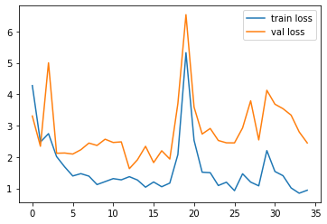
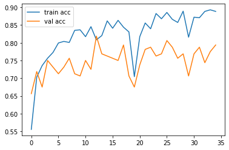
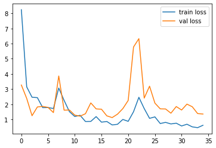
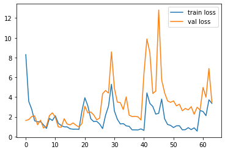
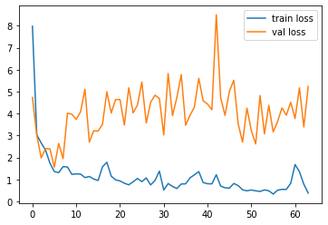
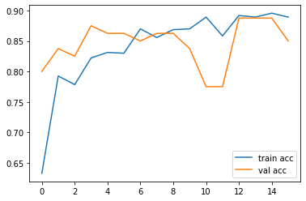

# Age group detection regardless of face mask during pandemic using Tensorflow/ResNet

## Description

Masks play a crucial role in protecting the health of individuals against respiratory diseases, as is one of the few precautions available for COVID-19 in the absence of worldwide vaccination. The other important thing is to protect the most vulnerable groups of people (usually, elderly) from exposing them to the excessive risk of attending public facilities with access control. In this work, we tried to provide a solution for dealing with the issue of image classification by face to provide instruments for government-related limitations. 

## Team members:
* Anastasiya Spirova
* Aleksandr Krainov
* Veselina Zatsepina
* Nikita Tsintsov
* Konstantin Kozhemyakov

## Dataset

### Description

The dataset represents huge number of images of people wearing face masks or not to be used extensively for train/test splitting. Selected files were double-checked to avoid data collection bias using common sense.

### Sources

The dataset obtained and combined from various open data sources, including following:
* https://www.kaggle.com/frabbisw/facial-age
* https://www.kaggle.com/nipunarora8/age-gender-and-ethnicity-face-data-csv
* https://www.kaggle.com/arashnic/faces-age-detection-dataset
* https://www.kaggle.com/andrewmvd/face-mask-detection
* manually obtained under-represented observations using Google search engine

### Structure

The dataset is curated and structured into three age groups (under 18, 18-65 and 65+) without initial test/train selection, which is achieved programmatically to allow manipulations with original data.

## Model 

### Motivation

ResNet was chosen for model training. A residual neural network (ResNet) is an artificial neural network (ANN) of a kind that builds on constructs known from pyramidal cells in the cerebral cortex. Residual neural networks do this by utilizing skip connections, or shortcuts to jump over some layers, which results in better accuracy and speed.

### Training and fitting

| Epochs  | Batch size.   | Image size   | DS updated | Loss                         | Accuracy                |
| ------- | ------------- | ------------ | ---------  | ----                         | -------------           |
|  35     | 32            |  [100x100]   |    v1      |      | |
|  35     | 64            |  [100x100]   |    v1      |      | |
|  64     | 64            |  [100x100]   |    v1      |      | |
|  64     | 64            |  [200x200]   |    v1      |  | |
|  64     | 64            |  [200x200]   |    v2      |  | |
|  64     | 64            |  [200x200]   |    v2      |  | |
|  16     | 16            |  [200x200]   |    v2      |      | |

## Deployment

Streamlit is an easy-to-use framework, perfect for building web apps without struggling with layout, event handlers, or document trees.
Its friendly methods make it a great tool to explore datasets, demonstrate machine learning models, computer vision, natural language processing, data visualizations, and many other data-centric projects.

* https://streamlit.io/
* https://towardsdatascience.com/data-apps-with-pythons-streamlit-b14aaca7d083
* https://towardsdatascience.com/image-classification-of-uploaded-files-using-streamlits-killer-new-feature-7dd6aa35fe0

## References

* ResNet https://en.wikipedia.org/wiki/Residual_neural_network
* Architecture https://towardsdatascience.com/comprehensive-introduction-to-neural-network-architecture-c08c6d8e5d98
* Activation https://towardsdatascience.com/7-popular-activation-functions-you-should-know-in-deep-learning-and-how-to-use-them-with-keras-and-27b4d838dfe6
* Loss https://neptune.ai/blog/keras-loss-functions
* Epochs https://towardsdatascience.com/epoch-vs-iterations-vs-batch-size-4dfb9c7ce9c9
* Optimization https://towardsdatascience.com/neural-network-optimization-7ca72d4db3e0
* Parameters tuning https://machinelearningmastery.com/recommendations-for-deep-learning-neural-network-practitioners/
* Batch size https://stats.stackexchange.com/questions/164876/what-is-the-trade-off-between-batch-size-and-number-of-iterations-to-train-a-neu
